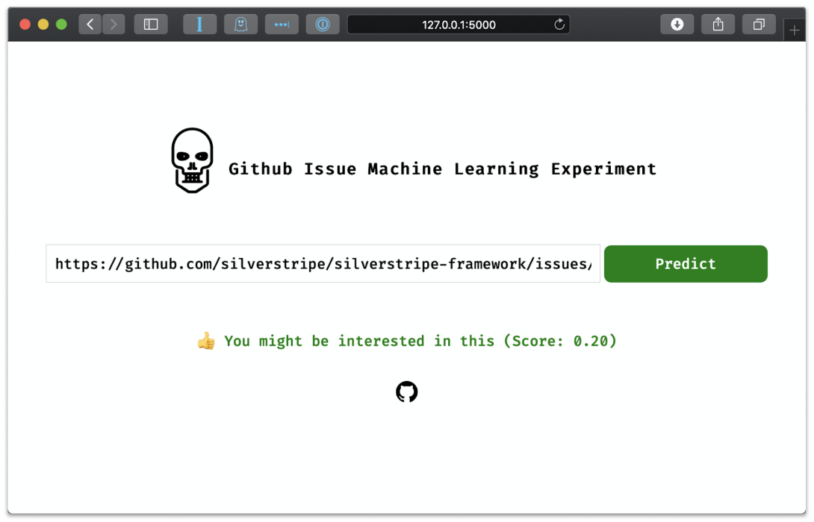

# Github Issue Relevancy Predictions

## Overview

Too many Github notifications, too little time.
The obvious answer there is to spend lots of time creating
a hyper personalised prediction engine that can tell me what I'm interested in.
And learn a whole bunch of stuff on the way. This is a tongue-in-cheek
experiment, which resulted in a realisation that I'm pretty unpredictable.



See it in action (predictions for the `chillu` github user):

[http://github-issue-ml-relevancy.herokuapp.com](http://github-issue-ml-relevancy.herokuapp.com)

## What does this do?

* Collect Github events from each repo the viewer has previously interacted with
* Score each issue and pull request based on the amount of interactions (if any)
* Train a neural network with both categorical and continuous data, with a regression learner
* Provide a prediction service for this user

The approach was also [presented](https://slides.com/chillu/deck-85620f) in Sept 2020 at the [virtual StripeConEU conference](https://stripecon.eu).

## Data Collection

The input parameters are sourced from [https://githubarchive.org](githubarchive.org),
a ~6TB data set of every Github event ever created. The data is accessible
via [Google BigQuery](https://cloud.google.com/bigquery/). We're only interested
in events related to repositories that the user has previously interacted with.
In my case, this got the training data set to about 20k rows.

See [notebook/learn.ipynb](notebook/learn.ipynb)
for the BigQuery queries run to retrieve the parameters.

## Training

Training happens via Python3 on the [Fast.AI](https://fast.ai) framework,
which builds on awesome libraries like [Pytorch](https://pytorch.org/),
[Scikit Learn](http://scikit-learn.org/) and [Pandas](http://pandas.pydata.org).
We're training both a Neural Network and a Random Forest.

See [notebook/learn.ipynb](notebook/learn.ipynb)
for a (non-interactive) snapshot of the training process.

## Prediction Frontend

The frontend is a [flask](https://flask.palletsprojects.com) web application
served by [gunicorn](https://gunicorn.org), powered by Python3. 
It's hosted on [Heroku](https://heroku.com).

Installation

```
pip3 install -r requirements.txt
```

Configuration (populate vars in new file)

```
cp .env.default .env
```

Start local server

```
FLASK_ENV=development FLASK_APP=app.py flask run
```

Deploy to Heroku

```
# Initialise new heroku project
heroku init
# Set up config vars
heroku config:set GITHUB_API_TOKEN="..."
heroku config:set VIEWER_LOGIN="..."
# Deploy
git push heroku master
```

## Prediction CLI

The CLI tool is an alternative to the web frontend.

Installation

```
pip3 install -r requirements.txt
```

Configuration

```
cp .env.default .env
```

Run 

```
python3 cli.py https://github.com/myorg/myrepo/issue/999
```

## TODO

 * Error when using repo that data set hasn't been trained on
 * Lock python deps via `pipenv`
